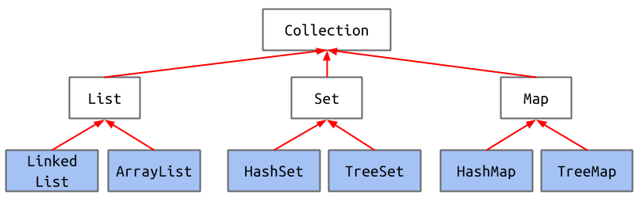

# Libraries, Abstract Classes, Packages

## ADTs
* Abstract data type → interface/idea

### Interface Inheritance for Comparison
* Interfaces provide way to containerize common functions (`OffByN` `CharacterComparator` allows comparison of 2 characters in special way)
* Interfaces = abstract data type, way to express capability of Objects

### Abstract Data Types
* **Abstract Data Type (ADT)** defined only by operations, not implementation

### Stack ADT
* `push(int x)`: Puts `x` on top of stack
* `int pop()`: Removes & returns top item from stack

## List & Set
### Collections
* Maps also known as associative arrays, associative lists (Lisp), symbol tables, dictionaries (Python)

## Java vs Python
* Every language has features that are "first class citizens"
    * Integral to language, shape approach to solving problems in that language
    * For first class data structures, often special syntax for creating & using such objects
* In Java, programmer can decide which _implementation_ of _abstract data type_ to use
    * Allows power user to resolve performance tradeoffs
* Iteration through `TreeMap` guaranteed to be in order, `HashMap` faster but guarantees no particular order
* Basic data structures in Java more closely resemble underlying hardware

## Abstract Classes
* Interface inheritance: What (class can do)
* Implementation inheritance: How (class does it)

### Closer Look at Interfaces
* Interfaces may combine mix of **abstract** & **default** methods
    * Abstract methods = **what**, must be overridden by subclass
    * Default methods = **how**
* Every method in interface must be `public` → `public` modifier redundant
* Unless using keyword **default**, method will be **abstract**
* Can provide variables in interfaces → will be **`public static final`**
    * `final` = value can never change → use for constants

### Interface Summary
* Cannot be instantiated
* Can provide either **abstract** or **concrete/`default`** methods
    * Use no keyword for abstract methods
    * Use **default** keyword for concrete methods
* Can provide only `public static final` variables (no instance variables)
* Can provide only `public` methods (no non-`public` helper methods)

### Abstract Classes
* Intermediate level between interfaces & classes
* Cannot be instantiated
* Can provide either **`abstract`** or **concrete** methods
    * Use **`abstract`** keyword for `abstract` methods
    * Use no keyword for concrete methods
* Can provide variables (any kind)
* Can provide methods (any kind)
* `abstract` methods must be implemented in subclasses
    * Implementations must override ALL `abstract` methods
* `abstract` class does not have to implement/list implemented interface's `abstract` methods

### Summary: Abstract Classes vs Interfaces
* Interfaces:
    * Primarily for interface inheritance, limited implementation inheritance
    * Classes can implement multiple interfaces
* Abstract classes:
    * Can do anything interface can do, & more
    * Subclasses only extend one abstract class

## Packages
### Canonicalization
* Want ability to provide canonical name for everything
    * ***Canonical representation:*** Unique representation for thing
    * Non-canonical: license plate # (can be reused, can change)
    * Canonical: VIN number refers to specific car/motorcycle
* In Java, attempt to provide canonicity by giving every class a "package name"
    * Package = ***namespace*** that organizes classes & interfaces

### Packages
* Address fact that classes might share names:
    * Naming convention: Package name starts w/ website address (backwards)
* If used from outside, use entire ***canonical name***
* If used from class in same package → can just use ***simple name***
* Can use import statement to provide shorthand notation for usage of single class in package
* Wildcard import: also possible to import multiple classes, but often bad idea
    * Use sparingly b/c contaminates namespace, implicit rather than explicit
    * Wildcard importing from multiple packages → may result in conflicts
