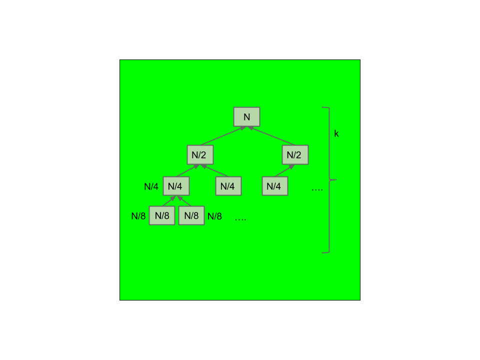

# Asymptotics II
* Use arithmetic/geometric sum formulas
    * **Arithmetic:**
        * $$S = n \cdot \frac{a_{1} + a_{n}}{2}$$
        * $$S = \frac{n}{2} \cdot [2a_{1} + (n - 1) \cdot d] = n \cdot a_{1} + \frac{(n - 1) \cdot n \cdot d}{2}$$
    * **Geometric:**
        * $$S = \frac{a_{1} \cdot (1 - r^{n})}{1 - r}$$
        * **Infinite ($$r < 1$$):** $$S = \frac{a_{1}}{1 - r}$$
* $$\text{lg}(N) = \log_2(N)$$
* $$\lceil f(N) \rceil \in \Theta(f(N))$$
* $$\lfloor f(N) \rfloor \in \Theta(f(N))$$

## Merge Sort

    

