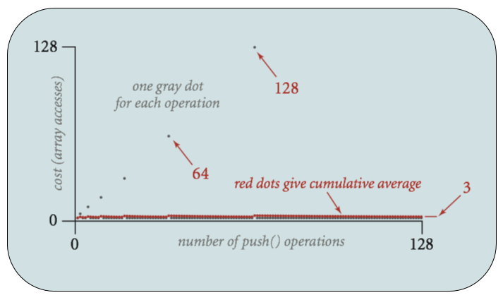

# Asymptotics III
## ArrayList

* ArrayList has average time that grows very slowly → converges to constant
* Given N items, cost of insert:
    * Worst case: 𝚯(N)
    * Average case: 𝚯(1)

## Using Potentials for Amortization
* Associate potential $$\Phi_i \geq 0$$ w/ $$i\text{th}$$ operation that tracks "saved up" time from cheap operations for spending on expensive ones, starting from $$\Phi_0 = 0$$
* Define cost of $$i\text{th}$$ operation as $$a_i = c_i + \Phi_{i + 1} - \Phi_i$$
    * $$a_i = \text{deposit}$$
    * $$c_i = \text{withdrawal/real cost of operation}$$
    * $$\Phi_{i + 1} - \Phi_i = \text{total holdings}$$
* On cheap operations, pick $$a_i > c_i$$ → $$\Phi$$ ↑
* On expensive operations, pick $$a_i : \Phi_i > 0$$
* Goals for ArrayList: $$a_i \in \Theta(1) \text{ and } \Phi_i \geq 0\ \forall\ i$$
    * Requires choosing $$a_i : \Phi_i > c_i$$
    * Cost for operations is 1 for non-powers of 2, & $$2i + 1$$ for powers of 2
    * For high cost ops, need $$\sim 2i + 1$$ in bank, have previous $$\frac{i}{2}$$ operations to reach balance
* On average, each op takes constant time, arrays = good lists
    * Rigorously show by overestimating constant time of each operation & proving resulting potential never < 0

## Empirical Analysis
### Tilde Notation
$$
f(n) \sim g(n) \iff \lim_{n \to \infty} \frac{f(N)}{g(N)} = 1
$$
