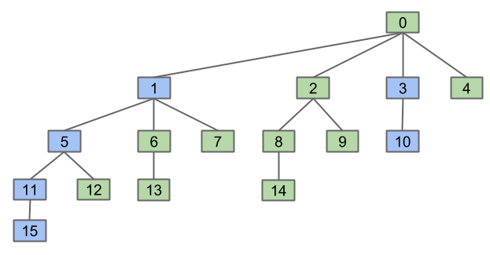
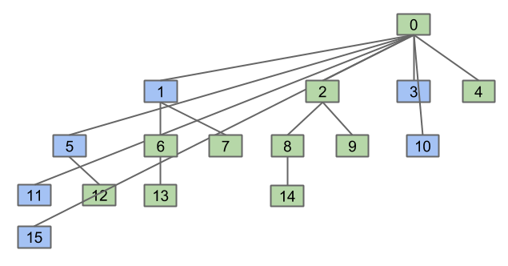
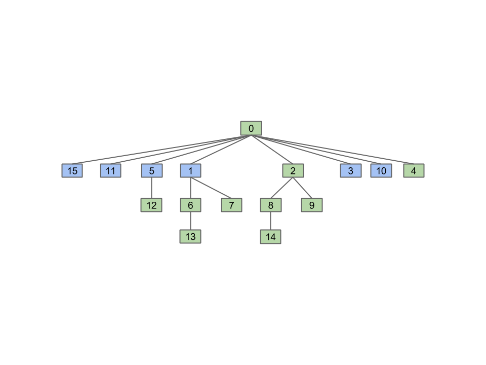

# Disjoint Sets

## Dynamic Connectivity
### Connected Components
* Record sets that something belongs to
* ***Connected component*** = maximal set of mutually connected items

## Quick Union
* Arrange in hierarchical tree structure
* Map items (array indices) to parents (parent indices)

## Weighted Quick Union
* Modify quick-union to avoid tall trees
    * Track tree size (**number** of elements), also works similarly for height
    * Always link root of ***smaller*** tree ***to larger*** tree
* Max depth of any item $$\log{N}$$
    * Depth of element `x` only increases when tree `T1` that contains `x` linked below other tree `T2`
        * Occurs only when `weight(T2) >= weight(T1)`
        * Size of resulting tree is at least doubled
        * Depth of element `x` incremented only when `weight(T2) >= weight(T1)` & resulting tree at least doubled in size
    * Tree containing `x` can double in size at most $$\log{N}$$ times, when starting from just 1 element
        * $$1 \cdot 2^x = N$$
        * $$x = \log_{2}{N}$$
    * Max depth starts at 0 for only 1 element (root) → increments at most $$\log_{2}{N}$$ times, $$\therefore$$ max depth = $$\log_{2}{N}$$

## Performance Summary
| Implementation | Constructor   | `connect`      | `isConnected`  |
|:--------------:|:-------------:|:--------------:|:--------------:|
| `QuickFindDS` | $$\Theta(N)$$ | $$\Theta(N)$$       | $$\Theta(1)$$       |
| `QuickUnionDS` | $$\Theta(N)$$ | $$O(N)$$       | $$O(N)$$       |
| `WeightedQuickUnionDS` | $$\Theta(N)$$ | $$O(\log{N})$$ | $$O(\log{N})$$ |

## Path Compression
* When doing `isConnected(15, 10)`, tie all nodes seen to the root
    * Additional cost insignificant (same order of growth)
* Kinda memoization/dynamic programming?
* Path compression results in union/connected operations very close to amortized constant time
* $$M$$ operations on $$N$$ nodes = $$O(N + M \lg^{*}{N})$$
* [$$\log^{*}{n} = \text{iterated/super logarithm}$$](https://en.wikipedia.org/wiki/Iterated_logarithm)
    * Inverse of [super exponentiation](https://en.wikipedia.org/wiki/Tetration)
* Tighter bound: $$O(N + M \alpha(N))$$, where $$\alpha$$ is the inverse [Ackermann function](https://en.wikipedia.org/wiki/Ackermann_function)

    
    
    

