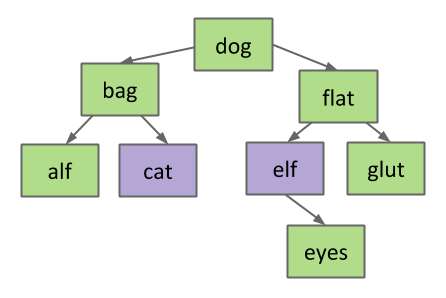

# Trees, BSTs
* BST = generalization of ordered linked list

## Tree
* Tree consists of:
    * Set of nodes
    * Set of edges connecting those nodes
        * Constraint: Exactly one path between any 2 nodes

## Rooted Trees & Rooted Binary Trees
* In rooted tree, one node = root
    * Every node N except root has exactly 1 parent → defined as first node on path from N to root
    * Node w/ no child = leaf
* In rooted binary tree, every node has either 0, 1, or 2 children (subtrees)
    * Each child = root of subtree

## Binary Search Trees
* BST = rooted binary tree w/ BST property
* **BST Property:** For every node $$X$$ in tree:
    * Every key in **left** subtree **<** $$X$$'s key
    * Every key in **right** subtree **>** $$X$$'s key
* Ordering must be complete, transitive, & antisymmetric
* Given keys $$p$$ & $$q$$:
    * $$p \prec q \oplus \text{(xor) } q \prec p$$
    * $$p \prec q \land q \prec r \implies p \prec r$$
    * Ordering based on `compareTo` method
    * $$\prec$$ = generalized less than (more than one way to order objects, can order by length, lexicographic, etc.)
        * `compareTo` < 0
* Consequence of rules = no duplicate keys allowed

## BST Operations
### Deleting from BST
* 3 cases:
    * Deletion key has no children
    * Deletion key has 1 child
    * Deletion key has 2 children

#### Case 1: Key w/ no Children
* Sever parent's link → garbage collected

#### Case 2: Key w/ 1 Child
* Goal = maintain BST property
* Key's child definitely larger than key's parent
    * Safe to just move key's child into key's spot

#### Case 3: Deleting w/ 2 Children (Hibbard deletion)
* Goal = find new root node
    * Must be > everything in left subtree
    * Must be < everything in right subtree
* Choose either predecessor ("cat") or successor ("elf")
    * Delete "cat" or "elf" → stick new copy in root position
        * Guaranteed to be either case 1 or 2
* Largest item in left subtree **always** has 0 or 1 child (otherwise not largest)

    

## BST Performance
* Random inserts take on average only $$\Theta(\log{N})$$ each

### BST: Mathematical Analysis
* **Comparison Counting:** If $$N$$ distinct keys are inserted into a BST, expected average # of compares per insert (depth) = $$C(N) \sim 2 \ln{N} = \Theta(\log{N})$$
* **Tree Height:** If $$N$$ distinct keys are inserted in random order, expected tree height $$H(N) \sim 4.311 \ln{N}$$
* Randomly deleting and inserting from tree changes height from $$\Theta(\log{N})$$ to $$\Theta(\sqrt{N})$$

## Summary
* Insertion of random data yields bushy BST
    * On random data, order of growth for get/put operations = logarithmic
* Performance issues:
    * Hibbard deletion results in $$\Theta(\sqrt{N})$$ order of growth
