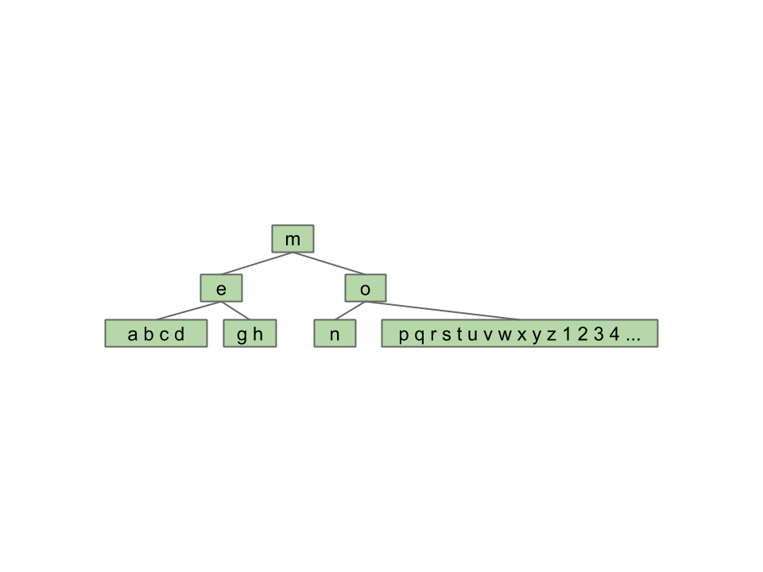
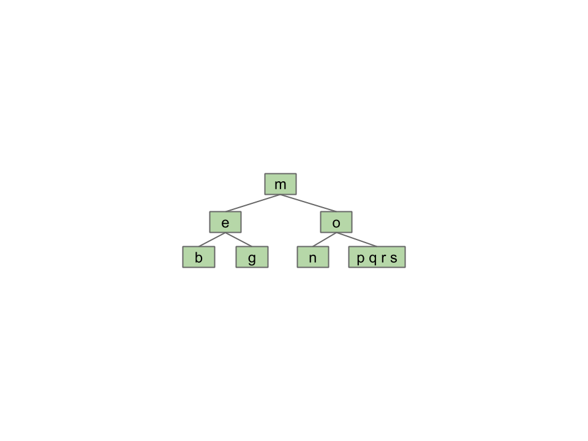
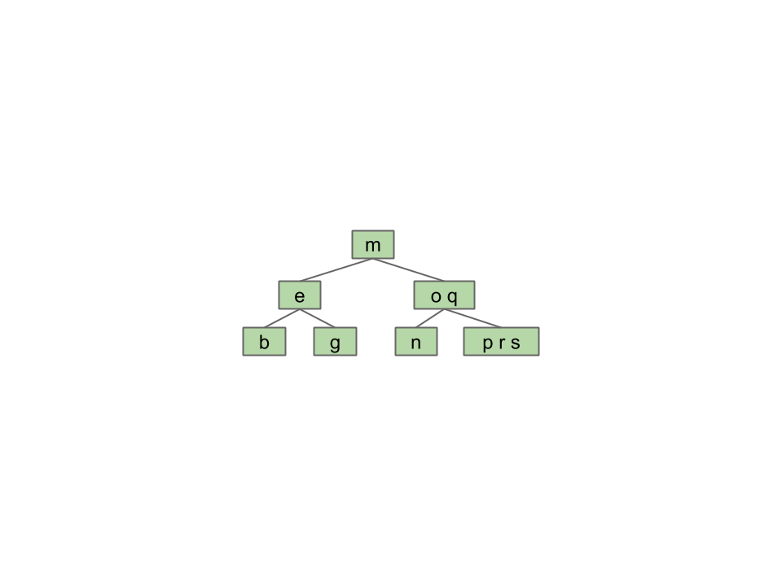

# Balanced BSTs

## Protosolution
* Problem = adding new leaves
* Not adding new leaves != can't add new data
* Solution = overstuff leaf nodes → tree can never get "imbalanced"

    

## Revising Overstuffed Tree Approach
* Set cap on # of items in leaf
* If leaf gets more elements than cap, give item to parent

    

    

### Node Splitting
* Pulling item out of juicy node splits node into nodes w/ elements left of and right of split item
* Examining node might cost Z compares, but aight since Z is capped
    * Z = # of items in node

### Insertion Chain Reaction
* Insert picture here

### Root too stuffed
* Insert picture here

## Perfect Balance
* Splitting trees guaranteed to have perfect balance
    * Split root, every node pushed down exactly one level
    * Split leaf/internal node, height doesn't change

## Per
* M = max # of children (one more than item cap)
* Height: between $$\log_{M}{N}$$ & $$\log_{2}{N}$$
* Max # of splitting operations per insert $$\sim H$$
* Time per insert/contains: $$\Theta(H) = \Theta(\log{N})$$

## B-Tree
* B-tree of order M=4 also called 2-3-4 tree (or 2-4 tree)
    * # of children node can have, (e.g. 2-3-4 tree may have 2, 3, or 4 children)
* B-tree of order M=3 also called 2-3 tree

## Terminology
* B-Trees popular in 2 specific contexts
* Small M (M=3, M=4):
    * Conceptually simple balanced search tree
* M very large(thousands)
    * Used in practice for databases & filesystems (systems w/ very large records)

## Tree Rotation
* `rotateLeft(G)` `G` moves left, **promote right child in most natural way**
* Semantics of tree completely unchanged
* Reverse operation → `rorateRight(P)`
* Rotations can increase/decreases tree height
* Given arbitrarily unbalanced tree, sequence of rotations exist that will yield balanced tree

## Red-Black Trees
* 2-3 trees & 2-3-4 trees pain to implement

* Build binary tree that maps diretly to 2-3 tree
* Create 'glue links' to reprsent 3-nodes
    * General idea used widely in practice
    * For 61B, only allow left leaning red links

## Left-Leaning Red Black Tree (LLRB)
* BST such that:
    * No node has 2 red links (otherwise like 4 node)
    * Every path from root to leaf has same # of black links
    * Red links lean left
* Red edges connect 2 elements in same node

* For any 2-3 tree, there exists corresponding red-black tree that has depth no more than 2 * depth of 2-3 tree
