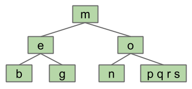
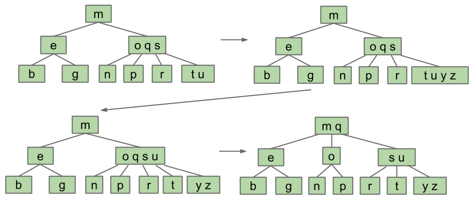
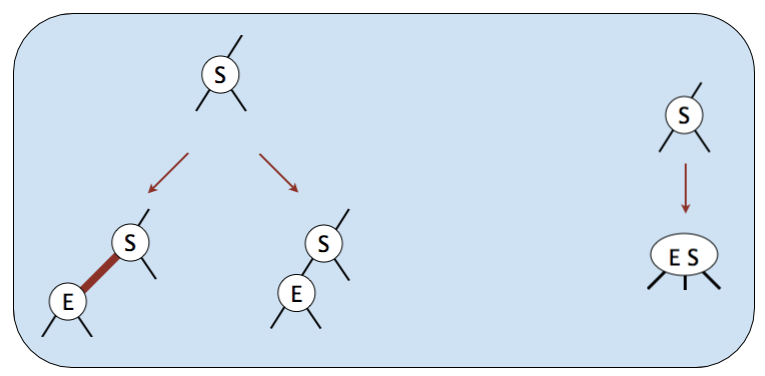
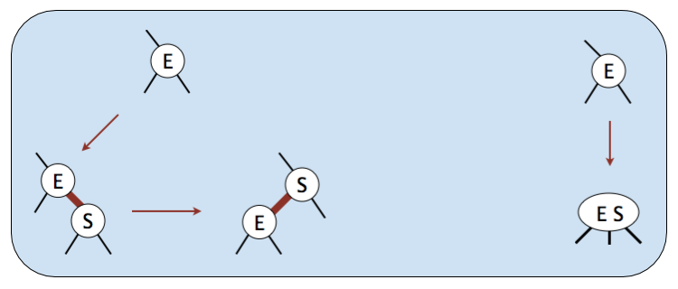
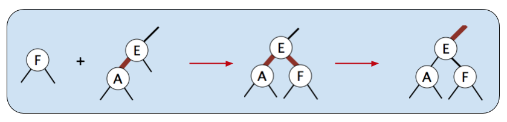
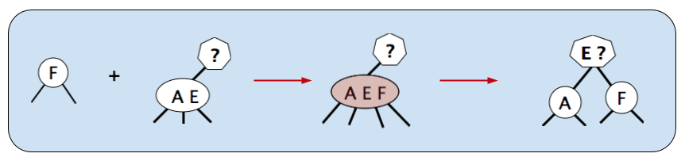
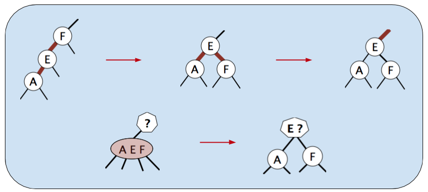
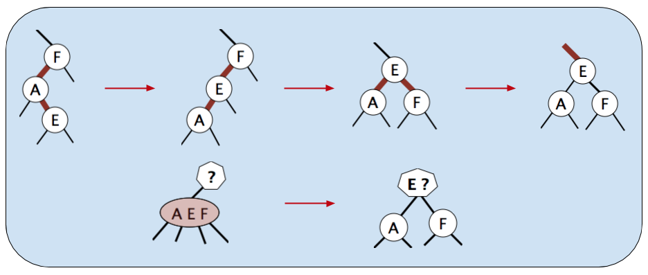

# Balanced BSTs

## Protosolution
* Problem = adding new leaves
* Not adding new leaves != can't add new data
* Solution = overstuff leaf nodes → tree can never get "imbalanced"

    

## Revising Overstuffed Tree Approach
* Set cap on # of items in leaf
* If leaf gets more elements than cap, give item to parent

    

    

### Node Splitting
* Pulling item out of juicy node splits node into nodes w/ elements left of and right of split item
* Examining node might cost Z compares, but aight since Z is capped
    * Z = # of items in node

    

### Insertion Chain Reaction

    

### Root too stuffed

    

### Perfect Balance
* Splitting trees guaranteed to have perfect balance
    * Split root → every node pushed down exactly one level
    * Split leaf/internal node → height doesn't change

### Perfect Balance & Logarithmic Height
* $$M$$ = max # of children (one more than item cap), optimal branching factor
* Height: Between $$\log_{M}{N}$$ & $$\log_{2}{N}$$
    * **Best case:** $$\log_{M}{N}$$ when every node has $$M - 1$$ elements (max # of elements) & $$M$$ children
    * **Worst case:** $$\log_{2}{N}$$ every node has 1 element & 2 children (BST)
* Max # of splitting operations per insert: $$\sim H$$
* Time per insert/contains: $$\Theta(H) = \Theta(\log{N})$$

## B-Tree
* B-tree of order $$M = 4$$ also called 2-3-4 tree (or 2-4 tree)
    * # of children node can have, (e.g. 2-3-4 tree node may have 2, 3, or 4 children)
* B-tree of order $$M = 3$$ also called 2-3 tree

### Terminology
* B-Trees popular in 2 specific contexts
    * Small $$M$$ ($$M = 3$$, $$M = 4$$):
        * Conceptually simple balanced search tree
    * $$M$$ very large (thousands)
        * Used in practice for databases & filesystems (systems w/ very large # of records)

## Tree Rotation
* Rotate tree about given node left or right
* `rotateLeft(G)` → `G` moves left, **promote right child in most natural way**
* Semantics of tree completely unchanged (nodes still in appropriate place w/ respect to ancestors)
* Reverse operation → `rotateRight(P)`
* Used to manage height of BSTs
* Rotations can increase/decrease tree height
* Preserves search tree property
* Given arbitrarily unbalanced tree, $$\exists$$ sequence of rotations that will yield balanced tree
* Balanced search tree = tree $$\propto \log{N}$$ w/in constant factor of 2
    * Want tree to be balanced → search/insertion operations $$\Theta(N)$$

    

## Red-Black Trees
* 2-3 trees & 2-3-4 trees pain to implement & suffer from performance problems
* Issues include:
    * Maintaining different node types
    * Interconversion of nodes between 2-nodes & 3-nodes
        * Conversion between nodes w/ variable # of children
    * Walking up height of tree to split nodes
        * Splitting nodes → creation of objects → non-trivial overhead on runtime of program

### Goal: Represent 2-3 Tree as Binary Tree
* Build binary tree that maps directly to 2-3 tree
* 3-node = 3 children (2 values)
    * 2-node = 2 children (1 value)
* Create 'glue links' to represent 3-nodes
    * General idea used widely in practice (e.g. `TreeSet`s)
    * For 61B simplicity, only allow left leaning red links

## Left-Leaning Red Black Tree (LLRB)
* BST (w/ colored edges) such that:
    * No node has 2 red links (otherwise like 4 node)
        * Red link = "glue" holding nodes in 2-3 tree's 3-nodes together
        * 2 red edges out of one node → 3 values w/in single single 2-3 tree node
            * Problem → 2-3 tree nodes have at most 2 values
    * **Every path from root to leaf has same # of black links**
        * Imposes balance on LLRB
        * Black edges in LLRB connect 2-3 nodes in 2-3 tree
        * 2-3 tree balanced on black edges → LLRB also balanced on black edges
            * Guaranteed logarithmic performance for `insert`
    * Red links lean left
* Red edges connect 2 elements in same node
* Walking along red edges analogous to walking through elements of stuffed node in B-tree
* # of red edges used on any given path from root to bottom of tree constrained
* Can have at most $$M - 1$$ consecutive red edges
* At most $$M - 1$$ red edges for every black edge along path
    * Height along any given path in red-black tree at most $$M\log{N}$$
* Searching LLRB tree for key just like BST
    * Red edges only matter in insertions
    * Red edges just like black edges for searching
* $$\forall$$ 2-3 tree (which is balanced), $$\exists$$ corresponding red-black tree that has depth $$\leq 2 \cdot \text{depth of 2-3 tree}$$

    

## Maintaining Isometry Through Rotations
* $$\exists$$ isometry between 2-3 tree & LLRB
* Implementation of LLRB based on maintaining isometry
* When performing LLRB operations, pretend as if 2-3 tree
* Preservation of isometry involves tree rotations

    

### Isometry Maintenance
* Use red link when inserting (in 2-3 trees, always start by ↑ node size)

    

#### Non-Trivial Case 1: Right-Insert
* Insert `S` w/ red link to leaf `E`
    

        
    

    * Fix by swapping roles of `S` & `E` → `rotateLeft(E)`

#### Non-Trivial Case 2: 2 Red Children
* Add `F` to LLRB tree containing `E` & `A`
    * **LLRB:** Flip colors

    

        
    

    * **2-3:** Split

    

        
    

#### Non-Trivial Case 3: 2 Reds-in-a-Row
* Add `A` to `E-F`
    * `rotateRight(F)` → 2 red children case → color flip

    

#### Case 1 & 3: Left-Red-Right-Red
* Add `E` to `F-A`
    * `rotateLeft(A)` → 2 reds in a row → `rotateRight(F)` → 2 red children → flip colors

    

#### Preserving Isometry After Addition/Insertion Operations
* Violations for 2-3 trees:
    * Existence of 4-nodes
* Operatiosn for fixing 2-3 tree violations:
    * Splitting 4-node
* Violations for LLRBs:
    * 2 red children
    * 2 consecutive red links
    * Right red child (wrong representation)
* Operations for fixing LLRB tree violations:
    * Tree rotations & color flips

    

## Summary
* 2-3 & 2-3-4 trees have perfect balance
    * Height guaranteed logarithmic
    * After `insert`/`delete` → at most 1 split operation per level of tree
        * Height logarithmic → $$O(\log{N})$$ splits
        * `insert`/`delete` $$O(\log{N})$$
    * Hard to implement
* LLRBs mimic 2-3 tree behavior using color flipping & tree rotation
    * Height guaranteed logarithmic
    * After `insert`/`delete` → at most 1 color flip or rotation per level of tree
        * Height logarithmic → $$O(\log{N})$$ flips/rotations
        * `insert`/`delete` $$O(\log{N})$$
    * Easier to implement, constant factor faster than 2-3 or 2-3-4 tree
