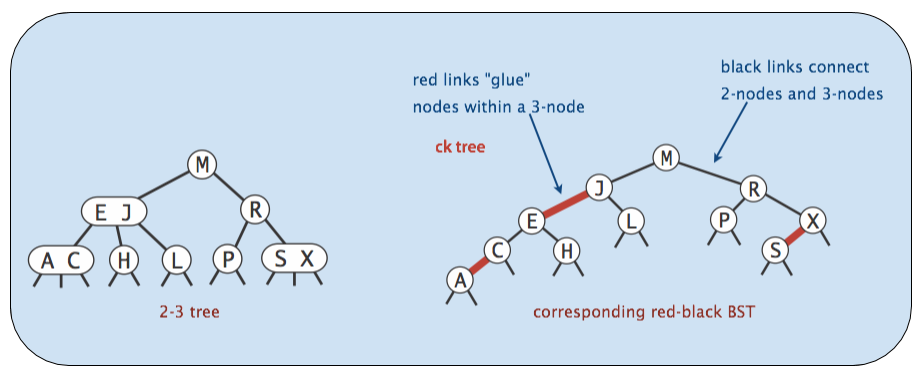

# Midterm 2 Notes

## Interfaces
* Every method in interface must be `public` (`public` by default)
* Variables will be `public static final`, no instance variables for interfaces

## Abstract Classes
* `abstract` keyword for `abstract` methods
* Can provide any kind of variables & methods
* Subclasses can only `extend` one (`abstract`) class

## Autoboxing
* Arrays never autoboxed/unboxed (e.g. `Integer[]` cannot be used in place of `int[]` & vice versa)
* Can cast `int` to `Integer`

### Promotion/Primitive Widening
* Similar thing happens when moving from primitive type w/ narrower range to wider range
    * Value is promoted
    * `double` wider than `int` → can pass `int` as arg to method that declares `double` param
        * `double` wider than `int`
* To move from wider format to narrower format, must use casting

## Immutability
* ***`final`*** helps compiler ensure immutability, not guarantee
    * Neither necessary nor sufficient for immutability
    * Can assign value only once (in constructor of class or initializer)
* Declaring reference **`final`** does not make object referred to by reference immutable
    * `public final ArrayDeque<String> d = new ArrayDeque<>();`
        * Memory box `d` not allowed to point at any other `ArrayDeque`, can't be changed to point at different `ArrayDeque`
        * Referenced `ArrayDeque` itself can change

## Generic Methods
* Types inferred from type of object passed in

### Type Upper Bounds
* Can use `extends` keyword as ***type upper bound***
    * Used as statement of fact, doesn't change definition/behavior of generic method parameter

## Checked vs Unchecked Exceptions
* Any subclass of **`RuntimeException`** or **`Error`** is _unchecked_
* All other `Throwable`s are _checked_

    

## Iteration
* Instantiate non-static nested class (inner class) → use `instance.new`
* Implement `Iterable` interface to support enhanced for loop
    * `iterator()` method must return object that implements `Iterator` interface

## Packages
* Cannot import/use/access code from default package from within different package

## Access Control
* Access based **only** on static types

### Access Control w/ Inheritance & Packages
* ***`protected`*** modifier allows package members & subclasses to use class member
* Package private: no modifier → allows classes from same package, _but not subclasses_ to access member

#### Access Levels
| Modifier      | Class | Package | Subclass | World |
|:-------------:|:-----:|:-------:|:--------:|:-----:|
| `public`      | Y     | Y       | Y        | Y     |
| `protected`   | Y     | Y       | Y        | N     |
| _no modifier_ | Y     | Y       | N        | N     |
| `private`     | Y     | N       | N        | N     |

### Access Control at the Top Level
* Two levels: `public`, no modifier (package-private)
    * Can't declare top level class as `private`/`protected`
* No such thing as a sub-package, `ug.joshh.Animal` & `ug.joshh.Plant` = 2 completely different packages

## `.equals()`
* Default implementation of `.equals()` uses `==`
* JUnit `assertEquals` uses `.equals()`
* `.equals()` parameter must take `Object`, cast to actual type w/in `.equals()` method
* Generally will need:
    * Reference check
    * `null` check
    * Class check w/ `.getClass()`
    * Cast to same type
    * Check fields

## Disjoint Sets
| Implementation         | Constructor   | `connect`      | `isConnected`  |
|:----------------------:|:-------------:|:--------------:|:--------------:|
| `QuickFindDS`          | $$\Theta(N)$$ | $$\Theta(N)$$  | $$\Theta(1)$$  |
| `QuickUnionDS`         | $$\Theta(N)$$ | $$O(N)$$       | $$O(N)$$       |
| `WeightedQuickUnionDS` | $$\Theta(N)$$ | $$O(\log{N})$$ | $$O(\log{N})$$ |

## Trees, BSTs
### Tree
* Constraint: Exactly one path between any 2 nodes

### BST
* Consequence of rules = no duplicate keys allowed in BST
* Random inserts take on average only $$\Theta(\log{N})$$ each
* Insertion of random data yields bushy BST
    * On random data, order of growth for get/put operations = logarithmic
* Randomly deleting and inserting from tree changes height from $$\Theta(\log{N})$$ to $$\Theta(\sqrt{N})$$
    * Hibbard deletion results in $$\Theta(\sqrt{N})$$ order of growth

## Balanced BSTs

### Perfect Balance & Logarithmic Height
* Max # of splitting operations per insert: $$\sim H$$
    * Time per insert/contains: $$\Theta(H) = \Theta(\log{N})$$

### Tree Rotation
* Preserves search tree property
* Given arbitrarily unbalanced tree, $$\exists$$ sequence of rotations that will yield balanced tree
* Balanced search tree = tree $$\propto \log{N}$$ w/in constant factor of 2

    
    

### Left-Leaning Red Back Tree (LLRB)
* **Every path from root to leaf has same # of black links**
    * Imposes balance on LLRB
    * Black edges in LLRB connect 2-3 nodes in 2-3 tree
    * 2-3 tree balanced on black edges → LLRB also balanced on black edges
        * Guaranteed logarithmic performance for `insert`
* Walking along red edges analogous to walking through elements of stuffed node in B-tree
* \# of red edges used on any given path from root to bottom of tree constrained
* At most $$M - 1$$ red edges for every black edge along path
    * Height along any given path in red-black tree at most $$M\log{N}$$
    * $$\forall$$ 2-3 tree (which is balanced), $$\exists$$ corresponding red-black tree that has depth $$\leq 2 \cdot \text{depth of 2-3 tree}$$
* Searching LLRB tree for key just like BST
    * Red edges only matter in insertions
    * Red edges just like black edges for searching

    

### Maintaining Isometry Through Rotations
* $$\exists$$ isometry between 2-3 tree & LLRB
* Implementation of LLRB based on maintaining isometry
* When performing LLRB operations, pretend as if 2-3 tree
* Preservation of isometry involves tree rotations

    

#### Preserving Isometry After Addition/Insertion Operations
* Violations for 2-3 trees:
    * Existence of 4-nodes
* Operations for fixing 2-3 tree violations:
    * Splitting 4-node
* Violations for LLRBs:
    * 2 red children
    * 2 consecutive red links
    * Right red child (wrong representation)
* Operations for fixing LLRB tree violations:
    * Tree rotations & color flips

    

### Summary
* 2-3 & 2-3-4 trees have perfect balance
    * Height guaranteed logarithmic
    * After `insert`/`delete` → at most 1 split operation per level of tree
        * Height logarithmic → $$O(\log{N})$$ splits
        * `insert`/`delete` $$O(\log{N})$$
    * Hard to implement
* LLRBs mimic 2-3 tree behavior using color flipping & tree rotation
    * Height guaranteed logarithmic
    * After `insert`/`delete` → at most 1 color flip or rotation per level of tree
        * Height logarithmic → $$O(\log{N})$$ flips/rotations
        * `insert`/`delete` $$O(\log{N})$$
    * Easier to implement, constant factor faster than 2-3 or 2-3-4 tree

## Hashing

### Hash Tables
* Never store mutable objects in `HashSet` or `HashMap`
* Never override `equals` w/out also overriding `hashCode`

### Hash Functions
* Computing hash function consists of 2 steps:
    1. Compute `hashCode` (integer between $$-2^{31}$$ & $$2^{31} - 1$$
    2. Computing index = `hashCode` $$\mod M$$

### Default `hashCodes()`
* All `Objects` have `hashCode()` function
* Default: returns `this` (address of object)

### Negative `.hashCode`s in Java
* In Java, `-1 % 4 == -1` → use `Math.floorMod` instead

### Summary
* W/ good `hashCode()` & resizing, operations are $$\Theta(1)$$ amortized
* Store & retrieval does not require items to be `Comparable` (unlike (balanced) BST)

| Data Structure                 | `contains(x)`       | `insert(x)`         |
|:------------------------------:|:-------------------:|:-------------------:|
| Linked List                    | $$\Theta(N)$$       | $$\Theta(N)$$       |
| Bushy BSTs (used by `TreeSet`) | $$\Theta(\log{N})$$ | $$\Theta(\log{N})$$ |
| Unordered Array                | $$\Theta(N)$$       | $$\Theta(N)$$       |
| Hash Table (used by `HashSet`) | $$\Theta(1)$$       | $$\Theta(1)$$       |
