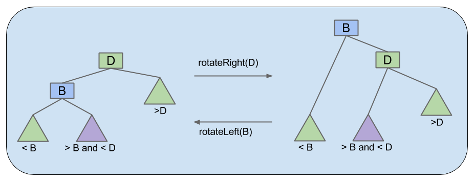

# Midterm 2 Notes

## Interfaces
* Every method in interface must be `public` (`public` by default)
* Variables will be `public static final`, no instance variables for interfaces


## Abstract Classes
* `abstract` keyword for `abstract` methods
* Can provide any kind of variables & methods
* Subclasses can only `extend` one (`abstract`) class


## Autoboxing
* Arrays never autoboxed/unboxed (e.g. `Integer[]` cannot be used in place of `int[]` & vice versa)
* Can cast `int` to `Integer`


### Promotion/Primitive Widening
* Similar thing happens when moving from primitive type w/ narrower range to wider range
    * Value is promoted
    * `double` wider than `int` → can pass `int` as arg to method that declares `double` param
        * `double` wider than `int`
* To move from wider format to narrower format, must use casting


## Immutability
* ***`final`*** helps compiler ensure immutability, not guarantee
    * Neither necessary nor sufficient for immutability
    * Can assign value only once (in constructor of class or initializer)
* Declaring reference **`final`** does not make object referred to by reference immutable
    * `public final ArrayDeque<String> d = new ArrayDeque<>();`
        * Memory box `d` not allowed to point at any other `ArrayDeque`, can't be changed to point at different `ArrayDeque`
        * Referenced `ArrayDeque` itself can change

## Generic Methods
* Types inferred from type of object passed in

### Type Upper Bounds
* Can use `extends` keyword as ***type upper bound***
    * Used as statement of fact, doesn't change definition/behavior of generic method parameter


## Checked vs Unchecked Exceptions
* Any subclass of **`RuntimeException`** or **`Error`** is _unchecked_
* All other `Throwable`s are _checked_

<p align="center">
    
</p>


## Iteration
* Instantiate non-static nested class (inner class) → use `instance.new`
* Implement `Iterable` interface to support enhanced for loop
    * `iterator()` method must return object that implements `Iterator` interface

## Packages
* Cannot import/use/access code from default package from within different package

## Access Control
* Access based **only** on static types

### Access Control w/ Inheritance & Packages
* ***`protected`*** modifier allows package members & subclasses to use class member
* Package private: no modifier → allows classes from same package, _but not subclasses_ to access member

#### Access Levels
| Modifier      | Class | Package | Subclass | World |
|:-------------:|:-----:|:-------:|:--------:|:-----:|
| `public`      | Y     | Y       | Y        | Y     |
| `protected`   | Y     | Y       | Y        | N     |
| _no modifier_ | Y     | Y       | N        | N     |
| `private`     | Y     | N       | N        | N     |


### Access Control at the Top Level
* Two levels: `public`, no modifier (package-private)
    * Can't declare top level class as `private`/`protected`
* No such thing as a sub-package, `ug.joshh.Animal` & `ug.joshh.Plant` = 2 completely different packages


## `.equals()`
* Default implementation of `.equals()` uses `==`
* JUnit `assertEquals` uses `.equals()`
* `.equals()` parameter must take `Object`, cast to actual type w/in `.equals()` method
* Generally will need:
    * Reference check
    * `null` check
    * Class check w/ `.getClass()`
    * Cast to same type
    * Check fields

## Asymptotics
* If function has runtime $$R(N)$$ with order of growth $$\Theta(N^2)$$:
    * $$R(N) \in \Theta(N^2) \forall \text{inputs}$$
    * Running function on input size of 1000 & input size of 10000 may not be large enough $$N$$ to exhibit quadratic behavior (i.e. takes 100 times longer to run)
        * $$\Theta$$ notation may abstract away potentially very large constant factors that may initially entirely determine the overall runtime for small inputs
* Use arithmetic/geometric sum formulas
    * **Arithmetic:**
        * $$S = n \cdot \frac{a_{1} + a_{n}}{2}$$
        * $$S = \frac{n}{2} \cdot [2a_{1} + (n - 1) \cdot d] = n \cdot a_{1} + \frac{(n - 1) \cdot n \cdot d}{2}$$
    * **Geometric:**
        * $$S = \frac{a_{1} \cdot (1 - r^{n})}{1 - r}$$
        * **Infinite ($$r < 1$$):** $$S = \frac{a_{1}}{1 - r}$$
* $$\text{lg}(N) = \log_2(N)$$
* $$\lceil f(N) \rceil \in \Theta(f(N))$$
* $$\lfloor f(N) \rfloor \in \Theta(f(N))$$

## Disjoint Sets
| Implementation         | Constructor   | `connect`      | `isConnected`  |
|:----------------------:|:-------------:|:--------------:|:--------------:|
| `QuickFindDS`          | $$\Theta(N)$$ | $$\Theta(N)$$  | $$\Theta(1)$$  |
| `QuickUnionDS`         | $$\Theta(N)$$ | $$O(N)$$       | $$O(N)$$       |
| `WeightedQuickUnionDS` | $$\Theta(N)$$ | $$O(\log{N})$$ | $$O(\log{N})$$ |

## Trees, BSTs
### Tree
* Constraint: Exactly one path between any 2 nodes

### BST
* Consequence of rules = no duplicate keys allowed in BST
* Random inserts take on average only $$\Theta(\log{N})$$ each
* Insertion of random data yields bushy BST
    * On random data, order of growth for get/put operations = logarithmic
* Randomly deleting and inserting from tree changes height from $$\Theta(\log{N})$$ to $$\Theta(\sqrt{N})$$
    * Hibbard deletion results in $$\Theta(\sqrt{N})$$ order of growth

## Balanced BSTs

### Perfect Balance & Logarithmic Height
* Max # of splitting operations per insert: $$\sim H$$
    * Time per insert/contains: $$\Theta(H) = \Theta(\log{N})$$

### Tree Rotation
* Preserves search tree property
* Given arbitrarily unbalanced tree, $$\exists$$ sequence of rotations that will yield balanced tree
* Balanced search tree = tree $$\propto \log{N}$$ w/in constant factor of 2

<p align="center">
    
    
</p>

### Left-Leaning Red Back Tree (LLRB)
* **Every path from root to leaf has same # of black links**
    * Imposes balance on LLRB
    * Black edges in LLRB connect 2-3 nodes in 2-3 tree
    * 2-3 tree balanced on black edges → LLRB also balanced on black edges
        * Guaranteed logarithmic performance for `insert`
* Walking along red edges analogous to walking through elements of stuffed node in B-tree
* \# of red edges used on any given path from root to bottom of tree constrained
* At most $$M - 1$$ red edges for every black edge along path
    * Height along any given path in red-black tree at most $$M\log{N}$$
    * $$\forall$$ 2-3 tree (which is balanced), $$\exists$$ corresponding red-black tree that has depth $$\leq 2 \cdot \text{depth of 2-3 tree}$$
* Searching LLRB tree for key just like BST
    * Red edges only matter in insertions
    * Red edges just like black edges for searching

<p align="center">
    
</p>

### Maintaining Isometry Through Rotations
* $$\exists$$ isometry between 2-3 tree & LLRB
* Implementation of LLRB based on maintaining isometry
* When performing LLRB operations, pretend as if 2-3 tree
* Preservation of isometry involves tree rotations

<p align="center">
    
</p>

#### Preserving Isometry After Addition/Insertion Operations
* Violations for 2-3 trees:
    * Existence of 4-nodes
* Operations for fixing 2-3 tree violations:
    * Splitting 4-node
* Violations for LLRBs:
    * 2 red children
    * 2 consecutive red links
    * Right red child (wrong representation)
* Operations for fixing LLRB tree violations:
    * Tree rotations & color flips

<p align="center">
    
</p>

### Summary
* 2-3 & 2-3-4 trees have perfect balance
    * Height guaranteed logarithmic
    * After `insert`/`delete` → at most 1 split operation per level of tree
        * Height logarithmic → $$O(\log{N})$$ splits
        * `insert`/`delete` $$O(\log{N})$$
    * Hard to implement
* LLRBs mimic 2-3 tree behavior using color flipping & tree rotation
    * Height guaranteed logarithmic
    * After `insert`/`delete` → at most 1 color flip or rotation per level of tree
        * Height logarithmic → $$O(\log{N})$$ flips/rotations
        * `insert`/`delete` $$O(\log{N})$$
    * Easier to implement, constant factor faster than 2-3 or 2-3-4 tree

## Hashing

### Hash Tables
* Never store mutable objects in `HashSet` or `HashMap`
* Never override `equals` w/out also overriding `hashCode`

### Hash Functions
* Computing hash function consists of 2 steps:
    1. Compute `hashCode` (integer between $$-2^{31}$$ & $$2^{31} - 1$$
    2. Computing index = `hashCode` $$\mod M$$

### Default `hashCodes()`
* All `Objects` have `hashCode()` function
* Default: returns `this` (address of object)

### Negative `.hashCode`s in Java
* In Java, `-1 % 4 == -1` → use `Math.floorMod` instead

### Summary
* W/ good `hashCode()` & resizing, operations are $$\Theta(1)$$ amortized
* Store & retrieval does not require items to be `Comparable` (unlike (balanced) BST)

| Data Structure                 | `contains(x)`       | `insert(x)`         |
|:------------------------------:|:-------------------:|:-------------------:|
| Linked List                    | $$\Theta(N)$$       | $$\Theta(N)$$       |
| Bushy BSTs (used by `TreeSet`) | $$\Theta(\log{N})$$ | $$\Theta(\log{N})$$ |
| Unordered Array                | $$\Theta(N)$$       | $$\Theta(N)$$       |
| Hash Table (used by `HashSet`) | $$\Theta(1)$$       | $$\Theta(1)$$       |

## [Priority Queues & Heaps](../lecture/week09/lec24/lec24.md)

### Priority Queue Interface
```java
/** (Min) Priority Queue: Allowing tracking & removal of smallest item in priority queue */
public interface MinPQ<Item> {
    public void add(Item x);
    public Item getSmallest();
    public Item removeSmallest();
    public int size();
}
```

* Only allows interaction w/ smallest item at any given time → better performance than `List`/`Set`
* Useful for keeping track of "smallest", "largest", "best", etc. seen so far

### Heaps
* Binary min-heap: Binary tree that is ***complete*** & obeys ***min-heap property***
    * **Min-heap property:** Every node $$\leq$$ both its children
    * **Complete:** Missing items only at bottom level (if any), all nodes as far left as possible

#### [Insertion](https://docs.google.com/presentation/d/1VEd2Pm_3OuvkC1M8T5XAhsBTQFxVHs386L79hktkDRg)
* Add to end of heap temporarily
* Swim up hierarchy

#### [Delete Min](https://docs.google.com/presentation/d/1VEd2Pm_3OuvkC1M8T5XAhsBTQFxVHs386L79hktkDRg/edit#slide=id.g11ecaeaf56_0_374)
* Swap last item in heap into root
* Sink down hierarchy (promote "better" successor)

### Tree Representation
* Store keys in array, offset everything by 1 spot
* Leave spot 0 empty
* Makes computation of children/parents "nicer"
    * `leftChild(k) = k * 2`
    * `rightChild(k) = k * 2 + 1`
    * `parent(k) = k / 2`

<p align='center'>
    
</p>

### Heap Implementation of a Priority Queue
| Operation        | Ordered Array | Bushy BST (items w/ same priority hard to handle) | Hash Table    | Heap                |
|:----------------:|:-------------:|:-------------------------------------------------:|:-------------:|:-------------------:|
| `add`            | $$\Theta(N)$$ | $$\Theta(\log{N})$$                               | $$\Theta(1)$$ | $$\Theta(\log{N})$$ |
| `getSmallest`    | $$\Theta(1)$$ | $$\Theta(\log{N})$$                               | $$\Theta(N)$$ | $$\Theta(1)$$       |
| `removeSmallest` | $$\Theta(N)$$ | $$\Theta(\log{N})$$                               | $$\Theta(N)$$ | $$\Theta(\log{N})$$ |

* Position in tree/heap = priority
* Heap is $$\log{N}$$ time amortized (resize backing array)
* BST can have constant `getSmallest` by keeping pointer to smallest
* Heaps handle duplicate priorities much more naturally than BSTs
* Array based heaps take less memory

### Data Structures Summary
#### [Search Data Structures](https://docs.google.com/presentation/d/1Y5egsKkY2Ya1-6FhOkRo7bekvmK464u7AznXQrMmGTI/edit#slide=id.g1d25fc641c_0_0)
| Data Structure | Storage Operation(s)                 | Primary Retrieval Operation | Retrieve By:   |
|:--------------:|:------------------------------------:|:---------------------------:|:--------------:|
| List           | `add(key)` <br> `insert(key, index)` | `get(index)`                | `index`        |
| Map            | `put(key, value)`                    | `get(key)`                  | key identity   |
| Set            | `add(key)`                           | `containsKey(key)`          | key identity   |
| PQ             | `add(key)`                           | `getSmallest()`             | key order/size |
| Disjoint Sets  | `conenct(int1, int2)`                | `isConnected(int1, int2)`   | 2 int values   |

## [Advanced Trees, including Geometric](../lecture/week09/lec25.md)
### Traversals

#### Tree Traversal
* Level Order
    * Traverse top-to-bottom, left-to-right
    * Nodes "visited" in given order
* [Depth First Traversals](https://docs.google.com/presentation/d/1ifkiC-l0DfQRXEHFfQpg_AcZkaUyj9CCEUKOYPuyBZ0/edit#slide=id.g75c09ac94_0693)
    * Preorder (root, left, right), Inorder (left, root, right), Postorder (left, right, root)
        * [A Weird Trick](https://docs.google.com/presentation/d/1ifkiC-l0DfQRXEHFfQpg_AcZkaUyj9CCEUKOYPuyBZ0/edit#slide=id.g75c09ac94_0715)
        * [Preorder Traversal Runtime](https://docs.google.com/presentation/d/1ifkiC-l0DfQRXEHFfQpg_AcZkaUyj9CCEUKOYPuyBZ0/edit#slide=id.g42d4f6d39_0109)
* Level Order Traversal
    * [Iterative Deepening](https://docs.google.com/presentation/d/1ifkiC-l0DfQRXEHFfQpg_AcZkaUyj9CCEUKOYPuyBZ0/edit#slide=id.g75c09ac94_028)
        * [Runtime](https://docs.google.com/presentation/d/1ifkiC-l0DfQRXEHFfQpg_AcZkaUyj9CCEUKOYPuyBZ0/edit#slide=id.g75c09ac94_0159) $$\Theta(N)$$ b/c each new level doubles amount of work done & # of nodes visited
            * Exponential in height of tree, $$\Theta(2^{H})$$ → height logarithmic in # of nodes, $$H = \Theta(\log{N})$$ → overall runtime linear in # of nodes, $$\Theta(N)$$
        * [Spindly Runtime](https://docs.google.com/presentation/d/1ifkiC-l0DfQRXEHFfQpg_AcZkaUyj9CCEUKOYPuyBZ0/edit#slide=id.g75c09ac94_0210) $$\Theta(N^{2})$$
        * [Tree Height & Runtime](https://docs.google.com/presentation/d/1ifkiC-l0DfQRXEHFfQpg_AcZkaUyj9CCEUKOYPuyBZ0/edit#slide=id.g75c09ac94_0223)

### Range Finding
* Instead of traversing entire tree, only want to look at items in certain range

#### Pruning & `findInRange` Runtime
* **Pruning:** Restrict search to only nodes containing path(s) to answer(s)
* [Runtime](https://docs.google.com/presentation/d/1ifkiC-l0DfQRXEHFfQpg_AcZkaUyj9CCEUKOYPuyBZ0/edit#slide=id.g11f3cf3f77_0_250)

### Spatial Trees

#### [Handling Multidimensional Data: Quadtrees](https://docs.google.com/presentation/d/1ifkiC-l0DfQRXEHFfQpg_AcZkaUyj9CCEUKOYPuyBZ0/edit#slide=id.g11f3cf3f77_0_157)
* [Generalization of BST](https://docs.google.com/presentation/d/1vqAJkvUxSh-Eq4iIJZevjpY29nagNTjx-4N3HpDi0UQ/edit#slide=id.g11f44e6637_0_250)
* Think of items as oriented in particular 2D direction (e.g NW/NE/SW/SE instead of binary </\>)
* Can have mutliple different quadtrees for same set of data
    * Just like BST, insertion order determines topology of QuadTree
* If on boundary line, usually assume = → >
* [Pruning](https://docs.google.com/presentation/d/1ifkiC-l0DfQRXEHFfQpg_AcZkaUyj9CCEUKOYPuyBZ0/edit#slide=id.g11f3cf3f77_0_350)
    * Analogous to binary search on BST (eliminate unnecessary search spaces)
    * Ignore branches if no possible way branch could contain wanted item

## [Graphs](../lecture/week10/lec26.md)
### [Graph Types](https://docs.google.com/presentation/d/1GOOt1Ierm9jJFq9o26uRW20GdU6E5hrAZvsoQIreJew/edit#slide=id.g52b1323b6_0160)
* **Directed:** Edges have notion of direction (one-way)
    * **Acyclic:** No cycles (lead back to start)
    * **Cyclic:** $$\exists \geq 1 \text{ cycle}$$
* **Undirected:** No notion of directionality, can traverse either way (bidirectional?)
    * **Acyclic:** No cycles (lead back to start) w/out reusing any edges
    * **Cyclic:** $$\exists \geq 1 \text{ path that leads to start w/out reusing any edges}$$
* Any graph w/ cycle = cyclic
    * If not → acyclic
* [Terminology](https://docs.google.com/presentation/d/1GOOt1Ierm9jJFq9o26uRW20GdU6E5hrAZvsoQIreJew/edit)
* [Graph Processing Problems](https://docs.google.com/presentation/d/1GOOt1Ierm9jJFq9o26uRW20GdU6E5hrAZvsoQIreJew/edit#slide=id.g76e0dad85_0_8)

### Graph Representations
* [Common Simplification](https://docs.google.com/presentation/d/1GOOt1Ierm9jJFq9o26uRW20GdU6E5hrAZvsoQIreJew/edit#slide=id.g76e0dad85_2_41)
* Degree = # of edges incident on graph node
* [Graph API](https://docs.google.com/presentation/d/1GOOt1Ierm9jJFq9o26uRW20GdU6E5hrAZvsoQIreJew/edit#slide=id.g127a4373ba_0_21)
* [Adjacency Matrix](https://docs.google.com/presentation/d/1GOOt1Ierm9jJFq9o26uRW20GdU6E5hrAZvsoQIreJew/edit#slide=id.g76e0dad85_2_79)
    * [Runtime](https://docs.google.com/presentation/d/1GOOt1Ierm9jJFq9o26uRW20GdU6E5hrAZvsoQIreJew/edit)
* [Edge Sets](https://docs.google.com/presentation/d/1GOOt1Ierm9jJFq9o26uRW20GdU6E5hrAZvsoQIreJew/edit#slide=id.g52b1323b6_0612)
* [Adjacency Lists](https://docs.google.com/presentation/d/1GOOt1Ierm9jJFq9o26uRW20GdU6E5hrAZvsoQIreJew/edit#slide=id.g471792ea7_033)
    * [Runtime](https://docs.google.com/presentation/d/1GOOt1Ierm9jJFq9o26uRW20GdU6E5hrAZvsoQIreJew/edit#slide=id.g127a4373ba_0_41)
        * If sparse graph (few edges) → $$\Theta(V)$$
        * If dense graph (many edges) → $$\Theta(E)$$
    * [Bare-Bones Undirected Graph Implementation](https://docs.google.com/presentation/d/1GOOt1Ierm9jJFq9o26uRW20GdU6E5hrAZvsoQIreJew/edit#slide=id.g76e0dad85_2_196)
* [Summary](https://docs.google.com/presentation/d/1GOOt1Ierm9jJFq9o26uRW20GdU6E5hrAZvsoQIreJew/edit#slide=id.g76e0dad85_2_142)

### [Depth First Traversal](https://docs.google.com/presentation/d/1GOOt1Ierm9jJFq9o26uRW20GdU6E5hrAZvsoQIreJew/edit#slide=id.g76e0dad85_2_380)
* [Implementation](https://docs.google.com/presentation/d/1GOOt1Ierm9jJFq9o26uRW20GdU6E5hrAZvsoQIreJew/edit#slide=id.g76e0dad85_2_480)
* Properties
    * Guaranteed to reach every reachable node
    * Runs in $$O(V + E)$$ time
        * Every edge used at most once, total # of vertex considerations = # of edges
            * \# of times need to consider vertex $$<=$$ # of edges incident on it
            * May be faster for some problems which quit early on some stopping condition (e.g. connectivity)


## [Graph Traversals](../lecture/week10/lec27.md)

### [Graph Problems](https://docs.google.com/presentation/d/1SeJA6Gup2Pti4jcn73khxIWR5iSmoe9tXnlMWq-aiDM/edit#slide=id.g99668982c_1_173)
* Runtime $$\Theta(V + E)$$
    * Each vertex visited exactly once, each visit = constant time
    * Each edge considered once
* Space $$\Theta(V)$$
    * Recursive call stack depth $$\leq V$$
    * Space of recursive algorithm = depth of call stack

### [Graph Traversals](https://docs.google.com/presentation/d/1SeJA6Gup2Pti4jcn73khxIWR5iSmoe9tXnlMWq-aiDM/edit#slide=id.g99668982c_1_30)
* Level-order/BFS for vertices at same distance from source can be in any permutation
* If $$\exists$$ multiple paths to a vertex, BFS always visits based on [closest path](https://docs.google.com/presentation/d/1SeJA6Gup2Pti4jcn73khxIWR5iSmoe9tXnlMWq-aiDM/edit#slide=id.g128656a55e_0_70)
* [Traversals & Graph Problems](https://docs.google.com/presentation/d/1SeJA6Gup2Pti4jcn73khxIWR5iSmoe9tXnlMWq-aiDM/edit#slide=id.g99668982c_1_670)

### [Topological Sorting](https://docs.google.com/presentation/d/1SeJA6Gup2Pti4jcn73khxIWR5iSmoe9tXnlMWq-aiDM/edit#slide=id.g99668982c_1_1182)
* Indegree 0 vertices → $$\Theta(E + V)$$, have to look at $$V$$ lists w/ total length $$E$$
* Only works if graph is acyclic → $$\varnothing$$ if cyclic b/c can't have circular dependencies
    * No indegree 0 vertices → cyclic → $$\varnothing$$
* Topological ordering only possible iff graph is directed acyclic graph (no directed cycles)
* [Linearizes graph](https://docs.google.com/presentation/d/1SeJA6Gup2Pti4jcn73khxIWR5iSmoe9tXnlMWq-aiDM/edit#slide=id.g99668982c_1_401)
* [Graph Problems](https://docs.google.com/presentation/d/1SeJA6Gup2Pti4jcn73khxIWR5iSmoe9tXnlMWq-aiDM/edit#slide=id.g99668982c_1_1236)

#### Implementation

```java
public class DepthFirstOrder {

    private boolean[] marked;
    private Stack<Integer> reversePostorder; // using stack analogous to reversing list b/c LIFO

    public DepthFirstOrder(Digraph G) {
        reversePostorder = new Stack<>();
        marked = new boolean[G.V()];
        for (int v = 0; v < G.V(); v++) {
            if (!marked[v]) {
                dfs(G, v);
            }
        }
    }

    private void dfs(Digraph G, int v) {
        marked[v] = true;
        for (int w : G.adj(v)) {
            if (!marked[w]) {
                dfs(G, w);
            }
        }
        reversePostorder.push(v); // after each DFS is done, "visit" vertex by pushing on stack
    }
}
```

* Works even when starting from vertices not indegree 0

### [Breadth First Search](https://docs.google.com/presentation/d/1SeJA6Gup2Pti4jcn73khxIWR5iSmoe9tXnlMWq-aiDM/edit#slide=id.g99668982c_1_1268)
* [Finding Level-Order](https://docs.google.com/presentation/d/1SeJA6Gup2Pti4jcn73khxIWR5iSmoe9tXnlMWq-aiDM/edit#slide=id.g99668982c_1_1302)

## Regular Expressions
* [Introducing the Regular Expression](https://docs.google.com/presentation/d/1T50c8YVBKzSBf97Hk1Jyt_3c27yY6-YKXplJP75BSC8/edit#slide=id.g1f24a78b1f_3_11)
* `[]` = set

### Regular Expressions in Java
* Default `String` method `matches` matches entire `String`, but not substrings
* `group(0)` = first match of entire pattern, entire match
    * `group(i)`, `i > 0` = parenthesized groupings
